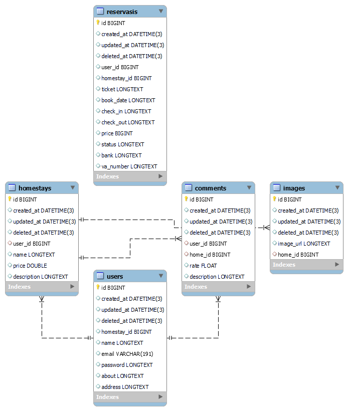

# BackEnd-Main
    
    About
    
AirBnB merupakan sebuah aplikasi manajemen penginapan. Sebagai seorang Software engineer aplikasi ini dibuat untuk membantu dalam menjalankan aktivitas penyewaan sebuah penginapan. 

## 1.User 
#### User adalah client yang menggunakan apps ini, dimana user bisa melakukan beberapa hal, sebagai berikut:
1. User can login;
3. User can update their proile;
4. User can delete their profile;
5. User can register;
6. User can update their registered homestay;
7. User can delete their registered homestay;
8. User can create homestay;
9. User can update reservation;
9. User can delete reservation;
10. User can get reservation;
11. User can create feedback.

## *Installation*

1. Clone source code dari github
```
https://github.com/Alta-group-project-3-group-4/BackEnd-Main.git
```
2. Aplikasi akan mulai dan berjalan
3. Registrasi user jika belum memiliki akun
4. Login untuk dapat menggunakan semua fitur yang tersedia

## *Entity Relational Database*

## 
<h3 align="Left">Programming Language :</h3>
<p align="Left"> 
  <a href="https://go.dev/" target="_blank" rel="noreferrer"> 
     </a> 
  <a href="https://www.mysql.com/" target="_blank" rel="noreferrer">
    &nbsp;
    </a>
</p>
 
<h3 align="Left">Tools :</h3>
<p align="Left"> 
  <a href="https://aws.amazon.com/" target="_blank" rel="noreferrer">
     </a> 
  <a href="https://postman.com/" target="_blank" rel="noreferrer"> 
     </a> 
  <a href="https://www.dockere.com/" target="_blank" rel="noreferrer"> 
     </a> 
  <a href="https://www.ubuntu.com/" target="_blank" rel="noreferrer"> 
     </a>
  <a href="https://www.swagger.com/" target="_blank" rel="noreferrer"> 
     </a>
  <a href="https://www.jwt.io/" target="_blank" rel="noreferrer"> 
     </a>
  <a href="https://github.com/" target="_blank" rel="noreferrer">
     </a> 
  <a href="https://skillicons.dev">
    
  </a>
 </p>

 
## 🤝Collaboration

<a href="https://discord.com/">
  </a>

### 🧰Backend

- [Github Repository for the Backend team](https://github.com/Alta-group-project-3-group-4/BackEnd-Main)
- [Swagger OpenAPI](https://app.swaggerhub.com/apis/AirBnBProject/AirBnB/1.0.0#/User/post_login)

### 🧰Frontend

- [Github Repository for the Frontend team](https://github.com/Alta-group-project-3-group-4/BookaBed-FE)
- [Figma]( https://www.figma.com/file/RMWgy3QKTLb1lojHM9RTpJ/Untitled?node-id=0%3A1&t=ObzGxefnuxSFiO8Y-0)

## 🤖Author

- Findryan Kurniap :

  []([https://github.com/ekacahyaps)
- Rischi Yuda:

  [ 
  ](https://www.linkedin.com/in/rischi-yuda-ryo17/)
